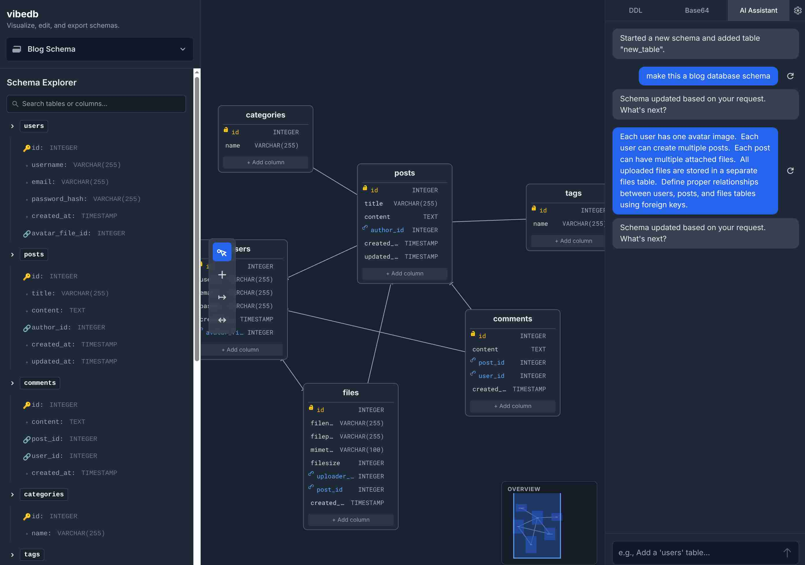

## vibedb

A tiny, toy vibe‑coded app whose goal is to help you model and vibe‑code database schemas.

Try here: https://pstwh.github.io/vibedb

### What it does
- **Manual editing**: Rich UI to create tables, edit columns, keys, relationships, and layout by hand.
- **AI assist (Gemini)**: Generate or modify schemas from a prompt, parse DDL into a schema, and emit DDL back out.

### Gemini setup
- **Set your own API key** (even a free one): open Settings in the app and paste your Gemini API key.
- The key is stored locally in your browser.

### Disclaimer
This is experimental software and a toy project for playing with vibe coding without manual editing. AI-generated database schemas may contain errors and inconsistencies. 

### Storage
- The app is completely client‑side.
- All information (schemas, settings, API key) is stored on your device.

